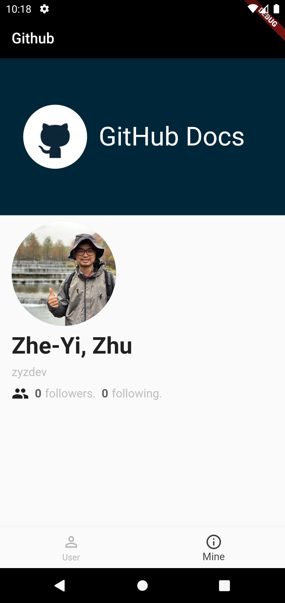

# bloc_pattern

This a practice for unit test and widget test with [git restful user api](https://docs.github.com/en/rest/reference/users#get-the-authenticated-user) and MVVM.


  |

**Folder structure**
```
    bloc_pattern
    |-- lib
    |   |-- main.dart
    |   |-- mine
    |   |   |-- mine_cubit.dart
    |   |   |-- mine_state.dart
    |   |   |-- model.dart
    |   |   |-- view.dart
    |   |   |-- view_model.dart
    |   |-- user_detail
    |   |   |-- model.dart
    |   |   |-- user_detail_cubit.dart
    |   |   |-- user_detail_state.dart
    |   |   |-- view.dart
    |   |   |-- view_model.dart
    |   |-- user_list
    |       |-- model.dart
    |       |-- user_list_cubit.dart
    |       |-- user_list_state.dart
    |       |-- view.dart
    |-- screenshot
    |   |-- Screenshot_1646446718.png
    |   |-- Screenshot_1646446720.png
    |   |-- Screenshot_1646446725.png
    |   |-- cubit.png
    |-- test
        |-- mine
        |   |-- mine_cubit_test.dart
        |   |-- mine_cubit_test.mocks.dart
        |   |-- model_test.dart
        |   |-- model_test.mocks.dart
        |   |-- view_test.dart
        |   |-- view_test.mocks.dart
        |-- user_detail
        |   |-- model_test.dart
        |   |-- model_test.mocks.dart
        |   |-- user_detail_cubit_test.dart
        |   |-- user_detail_cubit_test.mocks.dart
        |   |-- view_test.dart
        |   |-- view_test.mocks.dart
        |-- user_list
            |-- model_test.dart
            |-- model_test.mocks.dart
            |-- user_list_cubit_test.dart
            |-- user_list_cubit_test.mocks.dart
            |-- view_test.dart
            |-- view_test.mocks.dart
```
